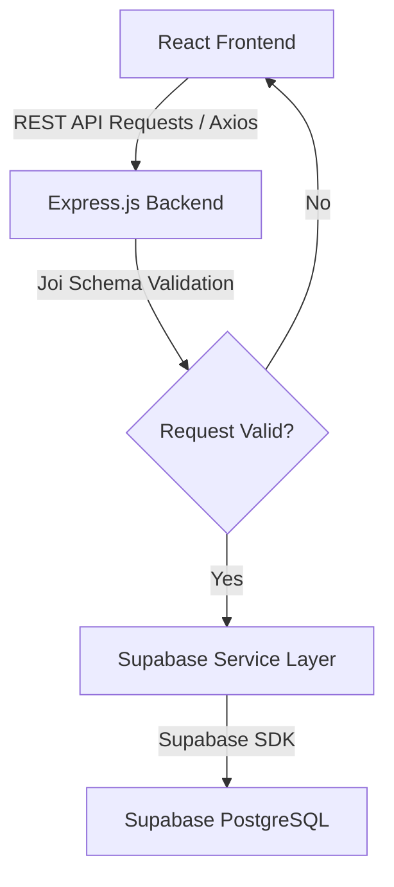

# ⚡ Taskly

<p align="left">
  <a href="https://react.dev/"></a>
  <a href="https://vitejs.dev/"></a>
  <a href="https://tailwindcss.com/"></a>
  <a href="https://nodejs.org/"></a>
  <a href="https://expressjs.com/"></a>
  <a href="https://supabase.com/"></a>
  <a href="https://www.postgresql.org/"></a>
</p>

**Taskly** is a production-ready, full-stack Task Management System featuring a highly interactive, responsive SaaS-style web interface and a robust Node.js/Express backend service powered by Supabase PostgreSQL.

---

## 📖 Table of Contents

- [Key Features](#-key-features)
- [System Architecture](#-system-architecture)
- [Tech Stack](#-tech-stack)
- [Folder Structure](#-folder-structure)
- [Database Schema](#-database-schema)
- [API Documentation](#-api-documentation)
- [Environment Configuration](#-environment-configuration)
- [Installation & Local Setup](#-installation--local-setup)
- [Deployment Guidelines](#-deployment-guidelines)
- [License](#-license)

---

## 🚀 Key Features

- **Live Dashboard Statistics**: Displays dynamically updating counts of *Total*, *Pending*, *In Progress*, and *Completed* tasks to give a high-level view of productivity.
- **Unified Workspace View**: Toggle between a modern **Grid Card View** (optimized for mobile/tablets) and a detailed **Table List View** (optimized for desktop power users).
- **Real-time Search & Filters**: Search task titles or descriptions instantly and filter by status pills (`Pending`, `In Progress`, `Completed`).
- **Robust Form Validation**: Two-layer validation with client-side form validation via `react-hook-form` and server-side safety checks via `Joi` schemas.
- **Responsive Dark Mode**: Smooth class-based dark mode transitions persisted inside `localStorage`.
- **State & API Architecture**: Centralized data management using a custom React hook (`useTasks`) and isolated API communication layers.
- **SaaS Design Polish**: Custom skeletons, empty states, toaster notifications (`react-hot-toast`), and responsive confirmation modals for destructive actions.

---

## 🏗️ System Architecture

Taskly follows a decoupled client-server architecture:



---

## 🛠️ Tech Stack

### Frontend
- **React.js & Vite**: Fast build tool and reactive user interface library.
- **Tailwind CSS**: Utility-first styling framework for rapid UI design.
- **React Router DOM v6**: Client-side routing.
- **React Hook Form**: Form state management and client-side validation.
- **Axios**: Configured HTTP client with request/response mapping.
- **Lucide React**: Lightweight SVG icon package.
- **React Hot Toast**: Responsive and beautiful notification popups.

### Backend
- **Node.js & Express.js**: Server runtime environment and minimalist API routing framework.
- **Joi**: Schema-based validation for request body payloads.
- **Supabase JS SDK**: Communication layer with PostgreSQL database.
- **CORS & Dotenv**: standard security and environment variable helpers.

### Database
- **Supabase PostgreSQL**: Managed relational database with UUID generation support, index optimizations, and validation check constraints.

---

## 📂 Folder Structure

```text
tasks/
├── backend/                  # Node.js/Express Backend App
│   ├── config/               # DB and Client Configs
│   │   └── supabase.js
│   ├── controllers/          # Request Controller handlers
│   │   └── taskController.js
│   ├── middleware/           # Joi validation & error handlers
│   │   ├── errorHandler.js
│   │   └── validateTask.js
│   ├── routes/               # Express API endpoints routing
│   │   └── taskRoutes.js
│   ├── services/             # Database access layer using Supabase SDK
│   │   └── taskService.js
│   ├── utils/                # Standardized response wrapper utility
│   │   └── responseHandler.js
│   ├── .env.example
│   ├── package.json
│   └── server.js
├── database/                 # SQL database migrations
│   └── schema.sql
├── frontend/                 # Vite/React Frontend App
│   ├── src/
│   │   ├── components/       # Reusable layout and helper elements
│   │   │   ├── Navbar.jsx
│   │   │   ├── ThemeToggle.jsx
│   │   │   ├── DashboardStats.jsx
│   │   │   ├── SearchBar.jsx
│   │   │   ├── FilterBar.jsx
│   │   │   ├── TaskCard.jsx
│   │   │   ├── TaskTable.jsx
│   │   │   ├── Loader.jsx
│   │   │   ├── EmptyState.jsx
│   │   │   └── DeleteModal.jsx
│   │   ├── context/          # Theme context provider (Dark/Light)
│   │   │   └── ThemeContext.jsx
│   │   ├── hooks/            # Custom state hook for task management
│   │   │   └── useTasks.js
│   │   ├── pages/            # Page-level route views
│   │   │   ├── Dashboard.jsx
│   │   │   └── AddTask.jsx
│   │   ├── routes/           # Routing configuration
│   │   │   └── AppRoutes.jsx
│   │   ├── services/         # Client API adapters
│   │   │   ├── api.js
│   │   │   └── taskService.js
│   │   ├── App.jsx
│   │   ├── index.css
│   │   └── main.jsx
│   ├── .env.example
│   ├── index.html
│   ├── postcss.config.js
│   ├── tailwind.config.js
│   └── vite.config.js
├── .env.example
├── .gitignore
└── README.md
```

---

## 🗄️ Database Schema

The backend connects to a PostgreSQL database hosted on Supabase. Below is the structure defined in [schema.sql](./database/schema.sql):

```sql
CREATE TABLE tasks (
    id UUID PRIMARY KEY DEFAULT gen_random_uuid(),
    title VARCHAR(255) NOT NULL,
    description TEXT NOT NULL,
    status VARCHAR(50) DEFAULT 'Pending' CHECK (status IN ('Pending', 'In Progress', 'Completed')),
    created_at TIMESTAMP WITH TIME ZONE DEFAULT TIMEZONE('utc'::text, NOW()) NOT NULL
);

-- Optimization Indexes
CREATE INDEX IF NOT EXISTS idx_tasks_status ON tasks(status);
CREATE INDEX IF NOT EXISTS idx_tasks_created_at ON tasks(created_at DESC);
```

---

## 🔌 API Documentation

All routes are nested under the base endpoint `/api/tasks`.

| Method | Endpoint | Description | Request Query | Request Body |
| :--- | :--- | :--- | :--- | :--- |
| **GET** | `/api/tasks` | Returns filtered/searched list of tasks | `?status=Pending&search=keyword` | None |
| **POST** | `/api/tasks` | Creates a new task | None | [Task Body Validation](#validation-rules-express-joi-middleware) |
| **PUT** | `/api/tasks/:id` | Updates a task's status | None | `{ "status": "In Progress" }` |
| **DELETE** | `/api/tasks/:id` | Deletes a task by ID | None | None |

### Validation Rules (Express Joi Middleware)
- **`title`**: String, Trimmed, Max 255 chars, **Required**
- **`description`**: String, Trimmed, Min 20 chars, **Required**
- **`status`**: String, must be one of `['Pending', 'In Progress', 'Completed']`, Defaults to `Pending`

<details>
<summary><b>🔍 Click to view API Response Examples</b></summary>

#### Successful GET `/api/tasks` Response (200 OK)
```json
{
  "success": true,
  "message": "Tasks retrieved successfully",
  "data": [
    {
      "id": "dbf2d93e-2fa6-4074-b586-b4bc5239a5ff",
      "title": "Document System Architecture",
      "description": "Establish clear visual mapping of data flows and services for the application.",
      "status": "In Progress",
      "created_at": "2026-06-19T22:27:35.000Z"
    }
  ]
}
```

#### Successful POST `/api/tasks` Response (201 Created)
```json
{
  "success": true,
  "message": "Task created successfully",
  "data": {
    "id": "dbf2d93e-2fa6-4074-b586-b4bc5239a5ff",
    "title": "Document System Architecture",
    "description": "Establish clear visual mapping of data flows and services for the application.",
    "status": "Pending",
    "created_at": "2026-06-19T22:27:35.000Z"
  }
}
```
</details>

---

## ⚙️ Environment Configuration

To run Taskly, you need to configure the following environment variables. Templates are provided in the repository configuration.

### Backend Config (`backend/.env`)
| Variable | Description | Example / Default |
| :--- | :--- | :--- |
| `PORT` | The local port the Express application binds to | `5000` |
| `SUPABASE_URL` | The endpoint URL of your Supabase API instance | `https://your-supabase-project.supabase.co` |
| `SUPABASE_ANON_KEY` | Public anonymous API key from your Supabase API settings | `your-supabase-anon-key-here` |

### Frontend Config (`frontend/.env`)
| Variable | Description | Example / Default |
| :--- | :--- | :--- |
| `VITE_API_URL` | The address of the Express backend server application | `http://localhost:5000` |

---

## 🛠️ Installation & Local Setup

### Prerequisites
- [Node.js](https://nodejs.org/) (v18.x or higher)
- A [Supabase](https://supabase.com/) project

### 1. Database Setup
1. Log in to your **Supabase Dashboard** and create a new project.
2. Navigate to the **SQL Editor** tab from the left sidebar.
3. Paste the contents of [schema.sql](./database/schema.sql) into the query editor and click **Run**.
4. Make a note of your **Project URL** and **API Anon Key** (available in Settings -> API).

### 2. Backend Installation
1. Navigate to the backend directory:
   ```bash
   cd backend
   ```
2. Install the node packages:
   ```bash
   npm install
   ```
3. Create a `.env` file from the example template:
   ```bash
   cp .env.example .env
   ```
4. Fill in your Supabase credentials:
   ```env
   PORT=5000
   SUPABASE_URL=https://your-supabase-project-id.supabase.co
   SUPABASE_ANON_KEY=your-supabase-anon-key-here
   ```
5. Start the server in development mode (using nodemon):
   ```bash
   npm run dev
   ```
   The backend should start on `http://localhost:5000`.

### 3. Frontend Setup
1. Navigate to the frontend directory:
   ```bash
   cd ../frontend
   ```
2. Install the node packages:
   ```bash
   npm install
   ```
3. Create a `.env` file from the example template:
   ```bash
   cp .env.example .env
   ```
4. Configure the backend connection:
   ```env
   VITE_API_URL=http://localhost:5000
   ```
5. Spin up the Vite development server:
   ```bash
   npm run dev
   ```
   Open your browser and navigate to `http://localhost:3000`.

---

## 🌎 Deployment Guidelines

Both the frontend and the backend are fully configured for easy, seamless deployment to **Vercel** as two separate services.

### 1. Backend Deployment (Vercel)
1. Go to your Vercel Dashboard and click **Add New Project**.
2. Link your GitHub repository.
3. Configure the project settings:
   - **Framework Preset**: Choose `Other` or `None`.
   - **Root Directory**: `backend`
4. Under **Environment Variables**, add:
   - `SUPABASE_URL` = *(your Supabase project URL)*
   - `SUPABASE_ANON_KEY` = *(your Supabase public anon key)*
5. **Serverless Execution**: We have preconfigured a [vercel.json](./backend/vercel.json) file in the `backend` folder. Vercel reads this automatically to run the Express API as a serverless function.
6. Click **Deploy**. Vercel will host your backend and provide a deployment URL (e.g., `https://task-backend.vercel.app`).

### 2. Frontend Deployment (Vercel)
1. Go to your Vercel Dashboard and click **Add New Project**.
2. Link the same GitHub repository.
3. Configure the project settings:
   - **Framework Preset**: Choose `Vite`.
   - **Root Directory**: `frontend`
4. Under **Environment Variables**, add:
   - `VITE_API_URL` = *(the URL of your newly deployed Vercel backend, e.g., `https://task-backend.vercel.app`)*
5. **Client-Side SPA Routing**: We have preconfigured a [vercel.json](./frontend/vercel.json) file in the `frontend` folder. Vercel reads this automatically to rewrite all dynamic page routing requests to `index.html` so React Router can process them without throwing 404 errors.
6. Click **Deploy**. Vercel will build, optimize, and host your client application.

---

## 📄 License

This project is licensed under the MIT License. See the [LICENSE](LICENSE) file for details.# Tasks

